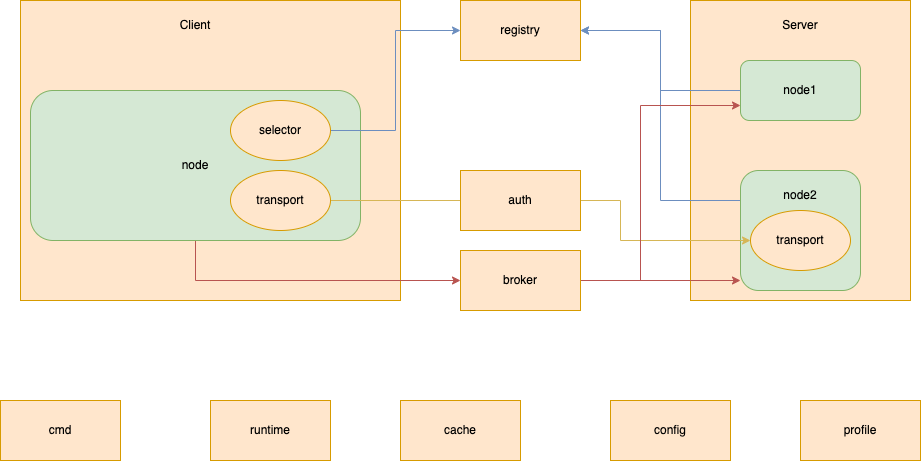
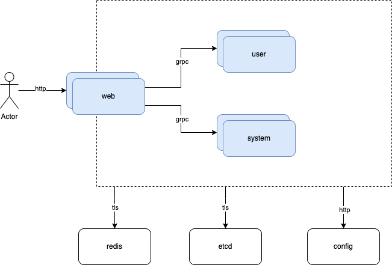
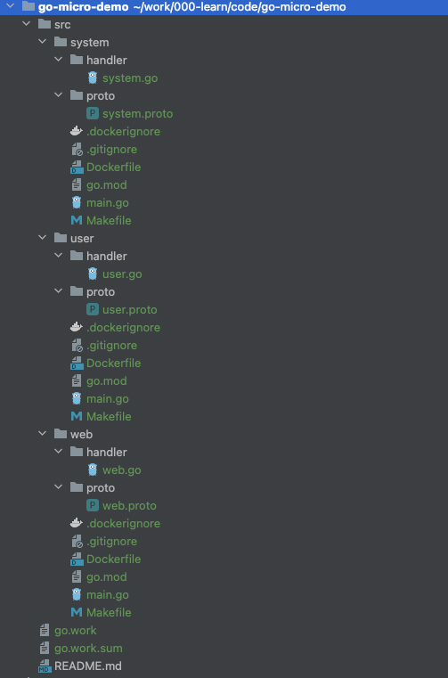
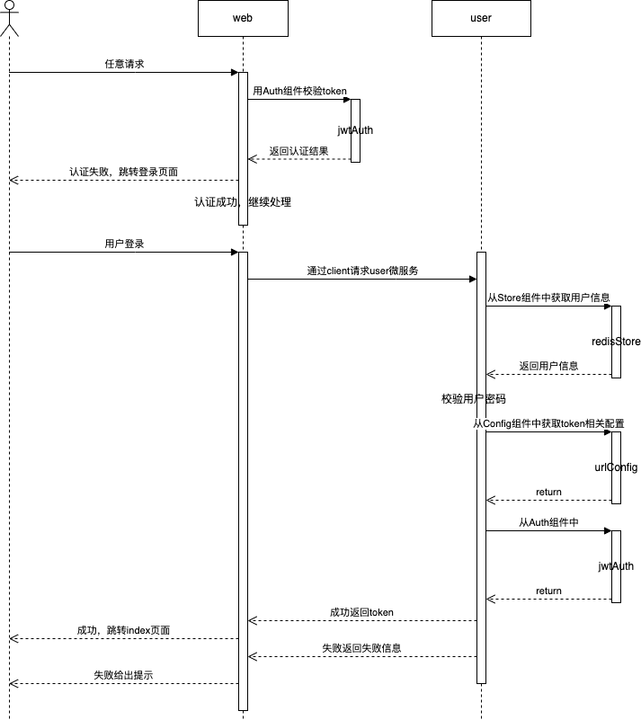

# go-micro介绍

## 简介

微服务已成为市面流行且成熟的框架。备受众多企业青睐。

以下是对一个主流的golang微服务框架[go-micro](https://github.com/go-micro/go-micro)的简单应用。

### 组件介绍



#### 组件定义

安装官方的定义，go-micro组件一般可以分为：

Auth:服务调用之间的认证组件。默认不使用认证，需要在服务处理逻辑中自行实现。

Broker:消息通知组件。消息发布方会向所有的消息订阅方推送消息。默认情况下，订阅端会发布一个broker的http请求地址，并注册到registry，发布端通过registry获取到所有订阅的服务节点，然后通过http请求推送消息。

Cache:服务的缓存组件。默认使用本地内存缓存。

Cmd:命令行工具组件。可通过命令行传参的方式来发布微服务。执行service.Init()时，会使用命令行中的参数会覆盖服务中的初始配置。

Config:配置中心组件。默认储存在本地内存中。

Client:客户端。用于发起微服务请求。默认使用官方原生的mucp协议。

Server:服务端。用于发布微服务，接收微服务请求并处理。默认使用官方原生的mucp协议。

Store:数据存储组件。默认使用本地内存存储。

Registry:注册中心。存放微服务的注册信息。默认使用mdns协议。

Runtime:服务运行时组件。可以管理其他微服务的启停状态等。

Transport:微服务通信协议。默认采用http

Profile:调试组件。可显示信息包括默认不配置。

# 项目实践

## 项目架构示意图




web：页面及路由微服务。负责与外部系统交互。接收所有的请求，并分发到对应的微服务。

user：用户功能微服务。处理用户相关功能。

system：管理员功能微服务。处理管理相关功能。

etcd：服务注册中心

redis：数据存储中心

config：动态配置中心

## 使用脚手架创建微服务

使用[官方脚手架](https://github.com/go-micro/cli)可以生成模板代码。不同的参数，可生成不同环境代码，可选参数如下

| 参数              |                                                              |
| ----------------- | ------------------------------------------------------------ |
| -                 | 生成基础代码                                                 |
| --jaeger          | Generate Jaeger tracer files                                 |
| --kubernetes      | Generate Kubernetes resource files                           |
| --skaffold        | Generate Skaffold files                                      |
| --tilt            | Generate Tiltfile                                            |
| --health          | Generate gRPC Health service used for Kubernetes liveliness and readiness probes |
| --kustomize       | Generate kubernetes resouce files in a kustomize structure   |
| --sqlc            | Generate sqlc resources                                      |
| --grpc            | Use gRPC as default server and client                        |
| --buildkit        | Use BuildKit features in Dockerfile                          |
| --tern            | Generate tern resouces; sql migrations templates             |
| --advanced        | Generate advanced features in main.go server file            |
| --privaterepo     | Amend Dockerfile to build from private repositories (add ssh-agent) |
| --namespace       | Default namespace for kubernetes resources, defaults to 'default' |
| --postgresaddress | Default postgres address for kubernetes resources, defaults to postgres.database.svc |
| --complete        | Complete will set the following flags to true; jaeger, health, grpc, sqlc, tern, kustomize, tilt, advanced |

下载脚手架：

```
go install github.com/go-micro/cli/cmd/go-micro@v1.1.1
```

创建微服务：

```shell
	go-micro new service system
	go-micro new service user
	go-micro new service web
```

创建工作区

```
go work init system user web
```

自动生成好的目录结构如下：




## 微服务配置

### 简单配置

go-micro框架提供了很多默认配置。有时只需要简单对配置就可以发布一个服务。

```go
func main() {
   // Create service
   srv := micro.NewService(
      micro.Name(service),
      micro.Version(version),
   )
   srv.Init()

   // Register handler
   pb.RegisterSystemHandler(srv.Server(), new(handler.System))
   // Run service
   if err := srv.Run(); err != nil {
      log.Fatal(err)
   }
}
```

### 全量配置

#### Server

**micro.Server(server.Server)**：定义微服务的服务端。

服务端用于接收并处理客户端请求。go-micro将服务端抽象成了server.Server接口。[官方Server插件库](https://github.com/go-micro/plugins/tree/main/v4/server)提供的服务端插件包含：grpc，http，mucp。默认采用mucp。

以mucp为例。mucp是go-micro的原生协议。**server.NewServer(...server.Option)**返回了server.rpcServer插件

**server.Name(string)**：配置服务名称。默认go.micro.server。也可以通过micro.Name(string)进行配置。

**server.Id(string)**：服务标识。默认通过uuid.New().String()生成。

**server.Version(string)**：服务版本。默认latest。

**server.Address(string)**：服务发布地址。使用transport.Listen监听时，传入的地址。默认:0。

**server.Advertise(string)**：服务发现地址。节点注册时，该地址随着节点信息一同注册到注册中心；客户端发起请求时，seletor通过服务名匹配到节点，然后通过该服务发现地址向节点发送请求。默认空，为空时使用服务发布地址的真实地址。

**server.Broker(broker.Broker)**：事件订阅方配置。用于处理接收到的事件通知，使用broker.Subscribe订阅事件。默认broker.httpBroker。

**server.Codec(contentType string, c codec.NewCodec)**：新增自定义消息解码器。服务端通过content-type获取消息解码器，对收到的请求进行解码，codec.ReadHeader方法解码消息头，codec.ReadBody方法解码消息体。当添加的content-type与默认的相同时，新增编码器的会覆盖默认的解码器。mucp默认的消息解码器如下：

| 默认解码器        | content-type                                                 |
| ----------------- | ------------------------------------------------------------ |
| grpc.NewCodec     | application/grpc<br />application/grpc+json<br />application/grpc+proto |
| json.Newcodec     | application/json                                             |
| jsonrpc.NewCodec  | application/json-rpc                                         |
| proto.NewCodec    | application/protobuf                                         |
| protorpc.NewCodec | application/proto-rpc                                        |
| raw.Newcodec      | application/octet-stream                                     |

**server.Context(context.Context)**：上下文，用于传递值。mucp服务中，有两个地方用到context。

1. 存储server.Wait(*sync.WaitGroup)设置的wait值
2. 传递到RegisterCheck方法中执行

**server.Tracer(trace.Tracer)**：服务链路追踪器，客户端发起请求时，构造一个包含trace-id和span-id的content，服务端处理请求时，会修改content中的span-id。当前版本该字段默认未用到。可通过server.WrapHandler()自主实现。

**server.Transport(transport.Transport)**：服务端通信协议，服务端通过Transport的Listen()方法发布服务监听。默认httpTransport。

**server.Metadata(map[string]string)**：设置元信息。元信息会在节点信息中展示，默认元信息有transport，broker，server，registry，protocol。默认的元信息无法修改。

**server.Registry(registry.Registry)**：服务注册中心，启动服务时，通过Regsitry的Register()方法向注册中心注册节点信息。

**server.RegisterTTL(time.Duration)**：注册生效时间，对应registry插件中的Timeout。默认90s。

**server.RegisterCheck(func(context.Context) error)**：注册检查。启动服务时，在节点注册前进行检查，检查通过才继续注册。服务运行时，进行周期性检查，检查失败的断开注册，检查成功的重新注册。默认对任何信息都检查通过。

**server.RegisterInterval(time.Duration)**：注册检查周期，执行注册检查的周期，为0时不进行周期检查。默认30s。

**server.TLSConfig(*tls.TLSConfig)**：设置transport监听的tls配置。

**server.WithRouter(server.Router)**：覆盖默认的请求路由。对客户端对请求进行处理，默认是server.router。ProcessMessage()处理事件，ServeRequest()处理微服务请求。

**server.Wait(*sync.WaitGroup)**：服务退出时，等待请求结束。传空也能设置成功。

**server.WrapHandler(server.HandlerWrapper)**：请求拦截器。构建请求处理链，先配置的先处理，最后处理router.ServeRequest方法

**server.Subwrapper(server.SubscriberWrapper)**：事件拦截器。构建事件处理链，先配置的先处理，最后处理router.ProcessMessage方法。

```go
srv := micro.NewService(
		micro.Server(
			server.NewServer(
				server.Name(service),
				server.Id(server.DefaultId),
				server.Version(version),
				server.Address(server.DefaultAddress),
				//server.Advertise(server.DefaultAddress),
				server.Broker(broker.DefaultBroker),
				server.Codec("application/text", func(closer io.ReadWriteCloser) codec.Codec {
					return &bytes.Codec{}
				}),
				server.Context(context.Background()),
				server.Registry(registry.DefaultRegistry),
				//server.Tracer(trace.DefaultTracer),
				server.Metadata(map[string]string{"description": "web ui and route"}),
				server.RegisterTTL(server.DefaultRegisterTTL),
				server.Context(context.WithValue(context.Background(), "isReady", true)),
				server.RegisterCheck(func(ctx context.Context) error {
					if !ctx.Value("isReady").(bool) {
						return fmt.Errorf("server not ready to registry")
					}
					return nil
				}),
				server.RegisterInterval(server.DefaultRegisterInterval),
				server.TLSConfig(&tls.Config{Certificates: []tls.Certificate{transportCert}}),
				//server.WithRouter(server.DefaultRouter),
				server.Wait(nil),
				server.WrapHandler(func(handlerFunc server.HandlerFunc) server.HandlerFunc {
					return func(ctx context.Context, req server.Request, rsp interface{}) error { // 支持链路追踪
						newCtx, s := trace.DefaultTracer.Start(ctx, "web")
						s.Type = trace.SpanTypeRequestInbound
						defer trace.DefaultTracer.Finish(s)
						return handlerFunc(newCtx, req, rsp)
					}
				}),
				server.WrapHandler(func(handlerFunc server.HandlerFunc) server.HandlerFunc { // 支持auth认证
					return func(ctx context.Context, req server.Request, rsp interface{}) error {
						token := req.Header()[authHeader]
						account, err := auth.DefaultAuth.Inspect(token)
						if err != nil {
							return err
						}
						return handlerFunc(context.WithValue(ctx, "account", account), req, rsp)
					}
				}),
				server.WrapSubscriber(func(subscriberFunc server.SubscriberFunc) server.SubscriberFunc {
					return func(ctx context.Context, msg server.Message) error {
						return subscriberFunc(ctx, msg)
					}
				}),
			),
		),
	)	
```

#### Server-补充字段

**micro.Name(string)**：同server.Name(string)

**micro.Version(string)**：同server.Version(string)

**micro.Address(string)**：同server.Address(string)

**micro.Tracer(trace.Tracer)：**同server.Tracer(trace.Tracer)

**micro.RegisterTTL(time.Duration)**：同server.RegisterTTL(time.Duration)

**micro.RegisterInterval(time.Duration)**：同server.RegisterInterval(time.Duration)

**micro.Metadata(map[string]string)**：同server.Metadata(map[string]string)

**micro.WrapHandler(...server.HandlerWrapper**)：同server.WrapHandler(server.HandlerWrapper)

**micro.WrapSubscriber(...server.SubscriberWrapper)**：同server.WrapSubscriber(server.SubscriberWrapper)

```go
srv := micro.NewService(
  micro.Name(service),
	micro.Version(version),
  micro.RegisterTTL(10*time.Second),
	micro.RegisterInterval(10*time.Second),
  micro.Metadata(),
  micro.WrapHandler(),
	micro.WrapSubscriber(),
)
```

#### client

**micro.Client(client.Client)**：定义微服务的客户端

客户端用于发送请求。go-micro将客户端抽象成了client.Client接口。[官方Client插件库](https://github.com/go-micro/plugins/tree/main/v4/client)提供的客户端插件包含：grpc，http，mucp。默认mucp。

以mucp为例。**client.NewClient(...client.Option)**返回了client.rpcClient插件。

**client.Broker(broker.Broker)**：事件发布方配置。用于发布事件通知，使用Broker.Publish方法发布事件。默认broker.httpBroker。

**client.Codec(string, codec.NewCodec)**：新增自定义消息编码器。客户端通过content-type获取消息编码器，对要发出的请求使用codec.Write方法进行编码。当添加的content-type与默认的相同时，新增编码器的会覆盖默认的编码器。消息编码器和消息解码器一一对应。

**client.ContentType(string)**：设置请求头的Content-Type。通过client.NewRequest()构造请求时，将该参数设置为请求头的Content-Type，客户端和服务端会根据该请求头，进行相应的编码和解码。默认applicaiton/json。

**client.PoolSize(int)**：连接池大小。连接池每个地址缓存连接池大小的连接，发起请求时，先通过pool.Get从连接池中获取连接，无法获取再创建新的连接；请求结束时，通过pool.Release将连接放回连接池，连接池满或连接出错时，关闭连接，并从连接池中丢弃。

**client.PoolTTL(time.Duration)**：连接池超时时间。连接创建时，会记录连接的创建时间，每次获取连接时，计算是否超时，超时时，关闭连接，并从连接池中丢弃。

**client.Transport(transport.Transport)**：客户端端通信协议，客户端通过Transport的Dial方法发起请求。默认httpTransport。

**client.Selector(selector.Selector)**：设置选择器。客户端先通过Registry.GetService，获取注册中心该服务所有的节点信息，然后通过选择器策略strategy，在注册中心获取一个服务端的节点信息，向节点发起请求。默认选择器为selector.registrySelector，该selector包含两个重要方法：

- selector.Registry(registry.Registry)：设置注册中心。
- selector.SetStrategy(func ([]*registry.Service) Next)：设置选择器算法。mucp提供的选择器算法有：

| strategy   | 描述                                             | 是否默认 |
| ---------- | ------------------------------------------------ | -------- |
| Random     | 每次请求随机选择节点                             | 是       |
| RoundRobin | 首次请求随机选择节点。接下来的请求按顺序选择节点 | 否       |
| 自定义方法 | 实现 func(services []*registry.Service) Next     |          |

**client.Registry(registry.Registry)**：用于设置选择器里的注册中心。同selector.Registry

**client.Wrap(client.Wrapper)**：客户端中间件。初始化客户端时执行的链方法。先配置的先执行，先执行其他参数的初始化，最后执行链路上的方法，返回最终的客户端。

**client.WrapCall(client.CallWrapper)**：请求中间件。每次请求时执行的链方法。先配置的先执行。先执行链路上的方法，最后执行client.call方法发起tcp请求。

**client.Backoff(client.BackoffFunc)**：请求备份。请求前执行，执行完成后，系统休眠方法返回的时间。

**client.Retry(client.RetryFunc)**： 请求是否重试。请求完成后，是否重新发起请求.mucp支持以下几种方法

| 重试方法            | 说明                                                         | 是否默认 |
| ------------------- | ------------------------------------------------------------ | -------- |
| client.RetryOnError | 失败重试                                                     | 是       |
| client.RetryAlways  | 总是重试                                                     | 否       |
| 自定义方法          | 实现。func(ctx context.Context, req Request, retryCount int, err error) (bool, error) | 否       |

**client.Retries(int)**：请求重试次数。默认1

**client.RequestTimeout(time.Duration)**：请求及响应超时时间。该参数将会设置到请求头Timeout。默认5s。

**client.StreamTimeout(time.Duration)**：流连接超时时间。该参数将会设置到请求头Timeout。默认5s。流连接，可以是双向流，也可以是单向流。

**client.DialTimeout(time.Duration)**：设置transport中的超时时间，默认5s

**client.WithRouter(Router)**：设置router，暂时没有用到

```go
srv := micro.NewService(
		micro.Server(
			client.NewClient(
				client.Broker(broker.DefaultBroker),
				client.Codec("application/text", func(closer io.ReadWriteCloser) codec.Codec {
					return &bytes.Codec{}
				}),
				client.ContentType(client.DefaultContentType),
				client.PoolSize(0),
				client.Selector(selector.NewSelector(selector.SetStrategy(selector.RoundRobin))),
				client.Registry(registry.DefaultRegistry),
				client.Wrap(func(c client.Client) client.Client { // 构造客户端
					if c.Options().Registry == nil {
						return nil
					}
					return c
				}),
				client.WrapCall(func(callFunc client.CallFunc) client.CallFunc {
					return func(ctx context.Context, node *registry.Node, req client.Request, rsp interface{}, opts client.CallOptions) error { // 设置请求链路追踪
						newCtx, s := trace.DefaultTracer.Start(ctx, "web")
						s.Type = trace.SpanTypeRequestInbound
						defer trace.DefaultTracer.Finish(s)
						return callFunc(newCtx, node, req, rsp, opts)
					}
				}),
				client.Backoff(func(ctx context.Context, req client.Request, attempts int) (time.Duration, error) { // 打印请求
					log.Infof("attempts %v, the req is %v", attempts, req.Body())
					return 0, nil
				}),
				client.Retry(func(ctx context.Context, req client.Request, retryCount int, err error) (bool, error) {
					return err != nil, nil
				}),
				client.Retries(client.DefaultRetries),
				client.RequestTimeout(client.DefaultRequestTimeout),
				client.StreamTimeout(client.DefaultRequestTimeout),
				client.DialTimeout(transport.DefaultDialTimeout),
				client.WithRouter(nil),
			),
		),
	)		
```

#### Client-补充字段

**micro.Selector(selector)**：同client.Selector。[官方Selector插件库](https://github.com/go-micro/plugins/tree/main/v4/selector)提供的选择器插件包含：dns，label，registry，shard，static。默认使用registry。

**micro.WrapClient(...client.Wrapper)**：同client.Wrapper(client.Wrapper)

**micro.WrapCall(...client.CallWrapper)**：同client.WrapCall(client.CallWrapper)

```go
srv := micro.NewService(
		micro.Selector(selector.DefaultSelector),
		micro.WrapClient(),
		micro.WrapCall(),
	)
```

#### Transport

**micro.Tranport(transport.Transport**)：统一定义服务端和客户端中使用的transport插件。

go-micro将服务通信抽象成了transport.Transport接口。[官方Transport插件库](https://github.com/go-micro/plugins/tree/main/v4/transport)提供了众多服务通信插件。包含：grpc，http，memory，nats，quic，rabbitmq，tcp，utp。默认http。

以http为例。transport.NewTransport()返回了transport.httpTransport插件。

**transport.Addr(...string)**：httpTransport中暂时没有用到。

**transport.Codec(codec.Marshaler)**：httpTransport中暂时没有用到。

**transport.Timeout(time.Duration)**：设置服务端和客户端，接收和发送消息的超时时间。零值表示不设置超时时间，默认零值。

**transport.Secure(bool)**：是否开启tls通信

**transport.TLSConfig(*tls.Config)**：tls证书认证配置，为空时，跳过tls校验。

```go
srv := micro.NewService(
		micro.Transport(
			transport.NewHTTPTransport(
				transport.Addrs(),
				transport.Codec(nil),
				transport.Timeout(transport.DefaultDialTimeout),
				transport.Secure(true),
				transport.TLSConfig(&tls.Config{Certificates: []tls.Certificate{caCert}}),
			),
		),
	)
```

#### Broker

**micro.Broker(broker.Broker)**：统一定义服务端和客户端中使用的broker插件。

go-micro将消息通知抽象成了broker.Broker接口。[官方Broker插件库](https://github.com/go-micro/plugins/tree/main/v4/broker)提供的插件包含：gocloud，googlepubsub，grpc，http，kafka，memory，mqtt，nats，nsq，proxy，rabbitmq，redis，segmentio，snssqs，sqs，stan，stomp。默认使用http。

以http为例。broker.NewBroker(...broker.Option)返回了broker.httpBroker插件。

**broker.Addrs(...string)**：broker订阅地址。发布方发布消息后，可通过该地址访问对应节点，进行消息通知。

**broker.Codec(codec.Marshaler)**：消息编码，解码器。发布消息时进行编码，接收消息时进行解码。

**broker.ErrorHandler(broker.Handler)**：消息错误处理逻辑。在memory插件中使用，发送消息出现错误时，进行的处理罗。

**broker.Registry(registry.Registry)**：设置注册中心，httpBroker在订阅时，会向注册中心注册一条节点订阅信息。httpBroker在发布消息时，会在注册中心找到所有订阅的节点，并向这些节点发送消息。

**broker.Secure(bool)**：是否开启tls通信

**broker.TLSConfig(*tls.Config)**：tls证书认证配置，为空时，跳过tls校验。

```go
srv := micro.NewService(
		micro.Broker(
			broker.NewBroker(
				broker.Addrs(),
				broker.Codec(json.Marshaler{}),
				broker.ErrorHandler(func(event broker.Event) error {
					return nil
				}),
				broker.Registry(registry.DefaultRegistry),
				broker.Secure(true),
				broker.TLSConfig(nil),
			),
		),
	)
```

#### Registry

**micro.Registry(registry.Registry)**：统一定义服务端，客户端，broker组件中使用的registry插件。

go-micro将服务注册抽象成了registry.Registry接口。[官方Registry插件库](https://github.com/go-micro/plugins/tree/main/v4/registry)提供了众多服务注册插件。包含：cache，consul，etcd，eureka，gossip，kubernetes，mdns，memory，mutli，nacos，nats，proxy，zookeeper。默认采用mdns协议。

以etcd为例。etcd.NewRegistry(...registry.Option)返回了etcd.etcdRegistry插件。

**registry.Addrs(...string)**：注册中心的地址。也可以通过环境变量MICRO_REGISTRY_ADDRESS，etcd默认127.0.0.1:2379。

**registry.Timeout(time.Duration)**：注册超时时间。通过registry.Timeout(time.Duration)设置，默认5s。

**registry.Secure(bool)**：是否启用tls认证。

**registry.TLSConfig(*tls.Config)**：tls认证证书配置。

**etcd用户名，密码**：通过环境变量ETCD_USERNAME设置用户名，环境变量ETCD_PASSWORD设置密码。

```go
srv := micro.NewService(
		micro.Registry(
      etcd.NewRegistry( // 设置etcd注册中心
      	registry.Addrs(),                 // etcd 地址。默认127.0.0.1:2379
      	registry.Timeout(10*time.Second), // 超时时间
      	registry.Secure(true),            // 是否启用tls
     	 	registry.TLSConfig(&tls.Config{Certificates: []tls.Certificate{pair}})
      ), // tls设置
    ),
	)
```

#### **Auth**

**micro.Auth(auth.Auth)**：定义认证插件。auth的创建和认证，需自行实现。比如在server拦截器中，实现auth逻辑。

go-micro将认证抽象成了auth.Auth接口。[官方Auth插件库](https://github.com/go-micro/plugins/tree/main/v4/auth)提供的插件包含：jwt。默认不使用认证。

以jwt为例。jwt.NewAuth(...auth.Option)返回了jwt.jwt插件。

**auth.Addrs(...string)**：认证地址。jwt未使用。

**auth.Namespace(string)**：微服务命名空间，以原数据Micro-Namespace存储在context中。

**auth.PublicKey(string)**：用于解码jwt。

**auth.PrivateKey(string)**：用于编码jwt。

**auth.Credentials(string, string)**：存储账号密码

**auth.ClientToken(*auth.Token)**：存储token值

```
srv := micro.NewService(
		micro.Auth(
			jwt.NewAuth(
				auth.Addrs(),
				auth.Namespace("blog"),
				auth.PublicKey("1234567"),
				auth.PrivateKey("7654321"),
				//auth.Credentials("root", "123"),
				//auth.ClientToken(&auth.Token{}),
			),
		),
	)
```

#### Cache

**micro.Cache(cache.Cache)**：定义缓存插件。

go-micro将缓存抽象成了cache.Cache接口。[官方Cache插件库](https://github.com/go-micro/plugins/tree/main/v4/cache)提供的插件包含：redis。默认使用本地内存缓存。

以redis为例。cache.NewCache(...cache.Option)返回了redis.redisCache插件。

cache.Expiration(time.Duration)：缓存失效时间。适用于本地缓存。

cache.Items(map[string]cache.Item)：缓存值，适用于本地缓存。

cache.WithAddress(string)：redis服务地址。默认redis://127.0.0.1:6379。

cache.WithContext(context.Context)：上下文。暂时没有用到。

```go
srv := micro.NewService(
		micro.Cache(
			cacheRedis.NewCache(
				cache.Expiration(10*time.Second),
				//cache.Items(nil),
				cache.WithAddress("redis://127.0.0.1:6379"),
				//cache.WithContext(context.Background()),
			),
		),
	)
```

#### Store

**micro.Store(store.Store)**：定义存储插件。一个store表示一张表。

go-micro将存储抽象成了store.Store接口。[官方Store插件库](https://github.com/go-micro/plugins/tree/main/v4/store)提供的插件包含：cockroach、consul、file、memcached、memory、mysql、nats-js、redis。默认使用memory。

以redis为例。redis.NewStore(...store.Option)返回了redis.redisCache插件。

**store.Nodes(...string)**：redis连接地址。支持redis集群。

**store.Database(string)**：数据库名称。redis没有用到。

**store.Table(string)**：表名称。redis中，key值由“表名称“+”key”组成

**store.WithContext(context.Context)**：上下文。redis没有用到。

**store.WithClient(client.Client)**：客户端。redis没有用到。

```go
srv := micro.NewService(
		micro.Store(
			redis.NewStore(
				store.Nodes("127.0.0.1:6379"),
				//store.Database("blog"),
				store.Table("web"),
				//store.WithContext(context.Background()),
				//store.WithClient(nil),
			),
		),
	)
```

#### Config

**micro.Config(config.Config)**：定义动态配置插件。

go-micro将动态配置抽象成了config.Config接口。默认使用的是config.config插件。[官方Config插件库](https://github.com/go-micro/plugins/tree/main/v4/config)提供了两类插件对config.config插件进行配置：

- 配置插件的格式包含：cue、hcl、toml、xml、yaml。默认json
- 配置插件的来源方包含：configmap，consul，etcd，grpc，mucp，nacos，nats，pkger，runtimevar，url，vault。默认内存。

先通过config.Load(...source.Source)，配置插件的来源及格式。然后通过config.Values中提供的方法，就可以对配置的值进行增删改等操作。

```go
cfg := config.DefaultConfig() // 定义插件
cfg.Load(etcd.NewSource(source.WithEncoder(yaml.NewEncoder()))) // 对插件进行配置
srv := micro.NewService(
		micro.Config(cfg),
	)
srv.Options().Config.Set("value","parentItem","childItem") // 设置配置
srv.Options().Config.Sync()
srv.Options().Config.Get("parentItem","childItem") // 读取配置值
```

#### Runtime

**micro.Runtime(runtime.Runtime)**：定义服务运行时。

go-micro将服务运行时抽象为runtime.Runtime接口。官方自带支持两种Runtime插件：kubernetes，memory。

kubernetes：通过k8sAPI对其他微服务进行管理。

memory：通过本地进程状态来对其他微服务进行管理。

以memory为例。runtime.NewRuntime(...runtime.Option)返回了runtime.runtime组件。

**runtime.WithSource(string)**：来源。暂未使用。

**runtime.WithScheduler(runtime.Scheduler)**：执行计划。服务运行时插件启动后，会开启一个循环来处理事件（事件类型包含：create，delete，update）。自定义执行计划可以发布一个事件交给服务运行时来处理。

**runtime.WithType(string)**：类型。暂时只在kubernetes中使用，以labels的方式展示。

**runtime.WithImage(string)**：镜像。暂未使用

**runtime.WithClient(client.Client)**：服务端，用于发起微服务请求。

```go
type scheduler struct {
	stop chan bool
}
func (s scheduler) Notify() (<-chan runtime.Event, error) {
	var a = make(chan runtime.Event)
	go func() {
		ticker := time.NewTicker(1 * time.Minute)

		for {
			select {
			case <-ticker.C:
				a <- runtime.Event{}
			case <-s.stop:
				return
			}
		}
	}()
	return a, nil
}
func (s scheduler) Close() error {
	s.stop <- true
	return nil
}

srv := micro.NewService(
		micro.Runtime(
			runtime.NewRuntime(
				runtime.WithSource("blog"),
				runtime.WithScheduler(&scheduler{}),
				//runtime.WithType("service"),
				//runtime.WithImage("web:1.0"),
				//runtime.WithClient(nil),
			),
		),
	)
```

#### Cmd

cmd控制程序的启动参数。go-micro，默认对组件的配置进行了参数话。可通过以下两个方法来扩展启动参数。

**micro.Flags(...cli.Flag)**：设置启动参数。

**micro.Action(func(*cli.Context) error)**：获取参数并处理。

```go
srv := micro.NewService(
		micro.Flags(&cli.StringFlag{
			Name:    "ca-cert-file",
			Usage:   "ca cert file path",
			EnvVars: []string{"CA_CERT_FILE"},
		}, &cli.StringFlag{
			Name:    "ca-key-file",
			Usage:   "ca key file path",
			EnvVars: []string{"CA_KEY_FILE"},
		}),
		micro.Action(func(c *cli.Context) error {
      caCertFile := c.String("ca-cert-file")
      caKeyFile := c.String("ca-key-file")
			return nil
		}),
	)
```

#### Profile

**micro.Profile(profile.Profile)**：定义了调试组件。

go-micro将调试插件抽象为profile.Profile接口。官方自带支持两种Profile插件：http，pprof

http：以http的形式，提供网页地址进行访问。访问地址：/debug/pprof

pprof：以文件的形式保存在本地目录。目录路径：系统临时目录

**profile.Name(string)**：设置调试组件的名称。

```go
srv := micro.NewService(
		micro.Profile(http.NewProfile(profile.Name("web"))),
	)
```

#### 流程控制

**micro.BeforeStart(func() error)**：服务启动前执行的方法。可设置多个，先设置的先执行。

**micro.AfterStart(func() error)**：服务启动后执行的方法。可设置多个，先设置的先执行。

**micro.BefortStop(func() error)**：服务关闭前执行的方法。可设置多个，先设置的先执行。

**micro.AfterStop(func() error)**：服务关闭后执行的方法。可设置多个，先设置的先执行。

**micro.HandleSignal(bool)**：是否支持通过系统信号来关闭服务。为true时，当收到SIGTERM、SIGINT、SIGQUIT、SIGKILL信号时，关闭服务。

```go
srv := micro.NewService(
  	micro.BeforeStart(func() error {
			log.Info("before start 1")
			return nil
		}),
		micro.AfterStart(func() error {
			log.Info("after start 1")
			return nil
		}),
		micro.BeforeStart(func() error {
			log.Info("before stop 1")
			return nil
		}),
		micro.BeforeStart(func() error {
			log.Info("after stop 1")
			return nil
		}),
		micro.HandleSignal(true),
	)	
```

### 配置执行顺序

由上述配置可以看到有许多重复的配置。go-micro采用的是循环加载配置。即放在前面的配置会先执行，后面的配置后执行，后执行的配置会覆盖先执行的配置。

比如：micro.NewService(micro.Server(server.Registry(r1)), micro.Registry(r2))，后配置的注册中心r2，会覆盖服务中先配置的注册中心r1。

## 功能开发

以认证功能为例



### 定义接口拦截器

web微服务采用gin框架作为web路由。采用中间件来进行统一拦截处理。

```go
router.Use(func(c *gin.Context) {
  	// 白名单放行
		for _, s := range micro.Service.Options().Config.Get("auth", "whiteList").StringSlice(make([]string, 0)) {
			if c.Request.URL.Path == s {
				c.Next()
				return
			}
		}
 
    // 通过Auth组件对token进行认证
		token := c.GetHeader(micro.AuthHeader)
		if token == "" {
			token, _ = c.GetQuery("token")
		}
		account, err := micro.Service.Options().Auth.Inspect(token)
		expireAt, _ := strconv.ParseInt(account.Metadata["expireAt"], 10, 0)
		if expireAt-time.Now().Unix() < int64(micro.Service.Options().Config.Get("auth", "refreshTime").Int(0)) {
			// token要到期时，自动续约
      // 从Config组件中获取token相关配置
			expireTime := micro.Service.Options().Config.Get("auth", "expireTime").Int(0)
			newAccount, err := micro.Service.Options().Auth.Generate(account.ID, auth.WithType("user"),
				auth.WithMetadata(map[string]string{
					"createAt": strconv.FormatInt(time.Now().Unix(), 10),
					"expireAt": strconv.FormatInt(time.Now().Add(time.Second*time.Duration(expireTime)).Unix(), 10),
				}))
			if err != nil {
				c.Redirect(http.StatusMovedPermanently, "/login")
				c.Abort()
			}
			newToken, err := micro.Service.Options().Auth.Token(auth.WithExpiry(time.Second*time.Duration(expireTime)), auth.WithCredentials(newAccount.ID, newAccount.Secret))
			if err != nil {
				c.Redirect(http.StatusMovedPermanently, "/login")
				c.Abort()
			}
			token = newToken.AccessToken
		}
		c.Set(micro.AuthHeader, token)
    // 认证失败，跳转到登录页面
		if err != nil {
			c.Redirect(http.StatusMovedPermanently, "/login")
			c.Abort()
		}
	})
```

### 定义接口路由

在gin路由中注册/login路由。然后在路由处理函数中，使用Client调用user微服务，完成注册

### protobuf消息通信

[protocol buffers](https://developers.google.com/protocol-buffers/docs/proto)是一个消息传输协议。用于微服务之前的消息通信。

#### protobuf定义

- 定义proto文件

```protobuf
option go_package = "./;user";

service User { // 服务名称
  rpc Login(LoginRequest) returns (LoginResponse) {} // 方法名称
  rpc Info(InfoRequest) returns (InfoResponse) {}
}

message LoginRequest {// 方法请求参数
  string username = 1;
  string password = 2;
}

message LoginResponse {// 方法响应参数
  string token = 1;
}

message InfoRequest {
}

message InfoResponse {
  string Id = 1;
  string Username = 2;
}
```

- 根据proto文件生成go代码

执行Makefile里面的init和proto

**init**：安装生成代码的必要软件。

**proto**：根据proto文件地址，来生成代码。

| 生成的文件      | 文件说明               |
| --------------- | ---------------------- |
| xxx.pb.go       | 定义服务及方法的结构体 |
| xxx.pb.micro.go | 定义服务的处理逻辑。   |

```makefile
.PHONY: init
init:
	@go get -u google.golang.org/protobuf/proto
	@go install github.com/golang/protobuf/protoc-gen-go@latest
	@go install github.com/asim/go-micro/cmd/protoc-gen-micro/v4@latest

.PHONY: proto
proto:
	@protoc --proto_path=. --micro_out=./proto/user --go_out=:./proto/user proto/user/user.proto

```

#### 服务端处理

- 实现接口具体处理逻辑

实现xx.pb.mico.go文件中的"{服务名称}Handler"接口

```go
type UserHandler interface {
	Login(context.Context, *LoginRequest, *LoginResponse) error
	Info(context.Context, *InfoRequest, *InfoResponse) error
}
```

- 将服务注册到go-micro中进行发布

在main方法中，调用xxx.pb.micro.go文件中的"Register{服务名称}Handler"方法。"server.Server"参数为定义的微服务，"{服务名称}Handler"参数为"{服务名称}Handler"接口具体实现类。

```go
func RegisterUserHandler(s server.Server, hdlr UserHandler, opts ...server.HandlerOption) error {
	type user interface {
		Login(ctx context.Context, in *LoginRequest, out *LoginResponse) error
		Info(ctx context.Context, in *InfoRequest, out *InfoResponse) error
	}
	type User struct {
		user
	}
	h := &userHandler{hdlr}
	return s.Handle(s.NewHandler(&User{h}, opts...))
}
```

#### 客户端处理

客户端通过Client.Call对对应的微服务发起请求。

```go
loginRsp := &user.LoginResponse{}
	if err := micro.Service.Options().Client.Call(context.Background(), micro.Service.Options().Client.NewRequest("user", "User.Login", &user.LoginRequest{Username: username, Password: password}), loginRsp); err != nil {
		ctx.HTML(422, "user/login.html", gin.H{
			"message": err.Error(),
		})
		return
	}
```

