注：基于[go-micro@v4.9.0](https://github.com/go-micro/go-micro/tree/v4.9.0)源码阅读。

# 微服务项目说明

## 创建微服务

使用官网提供的cli插件直接创建一个微服务

插件下载：go install github.com/go-micro/cli/cmd/go-micro@latest

创建微服务：go-micro new service helloworld

依赖更新及下载：make init proto update tidy

## 目录结构

微服务创建成功后，微服务包含以下几个目录结构

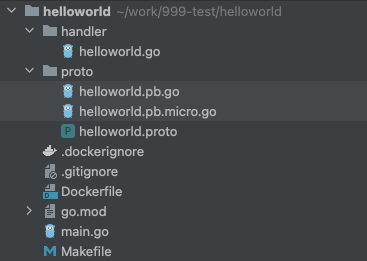

main.go：微服务启动入口

```go
func main() {
   // 组件配置
   srv := micro.NewService(
      //micro.Name(service),
      //micro.Version(version),
      micro.Server(server.DefaultServer),
      micro.Client(client.DefaultClient),
      micro.Broker(broker.DefaultBroker),
      micro.Registry(registry.DefaultRegistry),
      micro.Transport(transport.DefaultTransport),
      micro.Auth(auth.DefaultAuth),
      micro.Cache(cache.DefaultCache),
      micro.Cmd(cmd.DefaultCmd),
      micro.Config(config.DefaultConfig),
      micro.Runtime(runtime.DefaultRuntime),
      micro.Profile(profile.DefaultProfile),
      micro.Store(store.DefaultStore),
      micro.Logger(logger.DefaultLogger),
   )
   srv.Init()

   // 注册服务处理
   pb.RegisterHelloworldHandler(srv.Server(), new(handler.Helloworld))
   // 启动微服务
   if err := srv.Run(); err != nil {
      log.Fatal(err)
   }
}
```

main进行了三个操作：组件配置，注册服务处理，启动微服务

# 注册服务处理

- proto：定义服务

**helloworld.proto**：protobuf格式的协议定义服务

```protobuf
service Helloworld {
 rpc Call(CallRequest) returns (CallResponse) {}
 rpc ClientStream(stream ClientStreamRequest) returns (ClientStreamResponse) {}
 rpc ServerStream(ServerStreamRequest) returns (stream ServerStreamResponse) {}
 rpc BidiStream(stream BidiStreamRequest) returns (stream BidiStreamResponse) {}
}
```

上述定义了一个服务Helloworld，该服务包含4个方法：Call，ClientStream，ServerStream，BidiStream

**helloworld.pb.go**：由*protoc --go_out=:. proto/helloworld.proto*生成。该文件会包含方法入参，出参的结构体及对应的编码规范。

**helloworld.pb.micro.go**：由*protoc --micro_out=. proto/hellloworld.proto*生成。该文件会包含HelloworldHandler接口（该接口包含了4个服务方法），及该接口注册到微服务的RegisterHelloworldHandler。

- handler：微服务的具体处理逻辑

**helloworld.go**：实现helloworld.pb.micro.go中定义的HelloworldHandler接口。

注册流程，详见核心组件server.Server组件讲解；调用流程，详见client.Client组件讲解。

# 组件配置

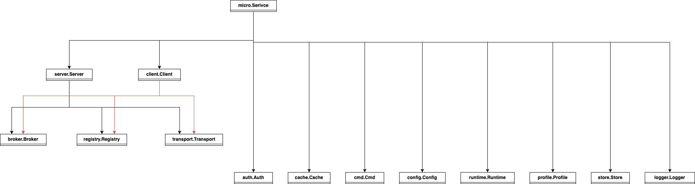

## 顶层结构

### micro.Service

微服务的顶层抽象。用于定义微服务的服务信息及控制着整个微服务生命周期。包含以下几个方法。

```go
type Service interface {
   // The service name
   Name() string
   // Init initialises options
   Init(...Option)
   // Options returns the current options
   Options() Options
   // Client is used to call services
   Client() client.Client
   // Server is for handling requests and events
   Server() server.Server
   // Run the service
   Run() error
   // The service implementation
   String() string
}
```

默认实现的结构体为micro.service

```go
type service struct {
   opts Options

   once sync.Once
}
```

**opts Options**是微服务的配置项，包含该微服务用到的其他组件，生命周期执行钩子函数（服务启动前执行钩子函数，服务关闭前执行的钩子函数，服务启动后执行的钩子函数，服务关闭后执行的钩子函数），服务上下文，是否启用系统信号关闭服务的配置项。

**once sync.Once**保证只执行一次加载启动参数。

## 核心组件

核心组件是构成微服务的必要组件

### server.Server

微服务的服务端。

```go
type Server interface {
   // Initialise options
   Init(...Option) error
   // Retrieve the options
   Options() Options
   // Register a handler
   Handle(Handler) error
   // Create a new handler
   NewHandler(interface{}, ...HandlerOption) Handler
   // Create a new subscriber
   NewSubscriber(string, interface{}, ...SubscriberOption) Subscriber
   // Register a subscriber
   Subscribe(Subscriber) error
   // Start the server
   Start() error
   // Stop the server
   Stop() error
   // Server implementation
   String() string
}
```

**以mucp的实现为例。**实现组件的结构体为server.rpcServer

```go
type rpcServer struct {
   router *router
   exit   chan chan error

   sync.RWMutex
   opts        Options
   handlers    map[string]Handler
   subscribers map[Subscriber][]broker.Subscriber
   // marks the serve as started
   started bool
   // used for first registration
   registered bool
   // subscribe to service name
   subscriber broker.Subscriber
   // graceful exit
   wg *sync.WaitGroup

   rsvc *registry.Service
}
```

rpcServer包含以下几种信息

- 服务处理

  rpcServer有两种服务处理。一种是表示服务请求的rpcHandler，一种是表示消息处理的subscriber。

  **rpcHandler**：一个微服务可定义多个rpc服务，每个rpc服务对应一个的rpcHandler，通过map的形式保存在rpcServer中。通过NewHandler方法生成，handler为一个自定义的结构体，该结构体对应rpc服务名，结构体上的外部方法对应rpc服务方法。

  **subscriber**：一个微服务可订阅多个消息，每个消息对应一个subscriber，通过map的形式保存在rpcServer中。通过NewSubscriber方法生成，参数topic表示订阅的消息；参数sub是一个方法，方法签名为"func(context.Context, interface{}) error"，表示该消息的处理逻辑。

- 路由

  **构建路由信息**

  

  绑定服务：用户将服务注册到框架中。rpcServer针对两种请求类型有不同的绑定方法

  解析服务：解析路由信息，解析服务处理信息存储到router中。

  服务注册：将服务信息，节点信息，路由信息，发送到服务注册中心进行注册。

  | 请求类型 | 绑定方法      | 存储方法  | router存储字段                        |
  | -------- | ------------- | --------- | ------------------------------------- |
  | 服务请求 | NewHandler    | Handle    | serviceMap map[string]*service        |
  | 消息通知 | NewSubscriber | Subscribe | subscribers map\[string][]*subscriber |

  **使用路由信息**

  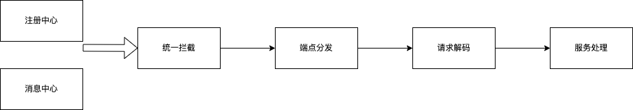

  接收消息：从注册中心或消息中心，接收到需要处理的请求。

  统一拦截：接受到请求后，执行中间件中的函数，先配置的先执行。

  端点分发：根据请求端点，匹配到分发器中的对应处理方法的放射类型。

  请求解码：根据content-type，对请求体进行解码，得到方法的入参。

  服务处理：使用入参，执行反射方法。

  rpcServer的router路由中存储着两种不同类型的路由。

  | 请求类型 | 中间件              | 分发器                    | 解码器                    | 服务处理   |
  | -------- | ------------------- | ------------------------- | ------------------------- | ---------- |
  | 服务请求 | []HandlerWrapper    | map[string]*service       | map[string]codec.NewCodec | rpcHandler |
  | 消息通知 | []SubscriberWrapper | map\[string][]*subscriber | map[string]codec.NewCodec | subscriber |

- 配置

  rpcServer包含多种配置信息

  - 节点信息配置：包含服务id，服务名称，监听地址，节点元数据，上下文等。
  - 组件配置：包含注册中心，消息中心，服务通信，编码器等
  - 拦截器配置：包含服务请求拦截器，消息通知拦截器。

- 状态信息

  rpcServer的状态信息包含：服务运行状态，注册状态，退出执行状态等。

### client.Client

微服务的客户端

```go
type Client interface {
   Init(...Option) error
   Options() Options
   NewMessage(topic string, msg interface{}, opts ...MessageOption) Message // 构建消息
   NewRequest(service, endpoint string, req interface{}, reqOpts ...RequestOption) Request // 构建服务请求
   Call(ctx context.Context, req Request, rsp interface{}, opts ...CallOption) error // 调用服务端
   Stream(ctx context.Context, req Request, opts ...CallOption) (Stream, error) // 构建双向通信
   Publish(ctx context.Context, msg Message, opts ...PublishOption) error // 发布消息
   String() string
}
```

**以mucp的实现为例。**实现组件的结构体为client.rpcClient

```go
type rpcClient struct {
   seq  uint64
   once atomic.Value
   opts Options
   pool pool.Pool
}
```

rpcClient包含以下几种信息

- 请求链

  

  构建请求：rpcClient针对两种不同的请求类型，有不同构建方法

  | 请求类型 | 构建请求方法 | 发起请求方法 |
  | -------- | ------------ | ------------ |
  | 服务请求 | NewRequest   | Call         |
  | 消息通知 | NewMessage   | Publish      |

  请求备份：发起请求后，通过BackoffFunc函数对请求进行备份，备份时，会阻塞请求。rpcClient没有默认的请求备份，支持自定义配置BackoffFunc函数

  选择节点：从注册中心获取请求目标服务对应的所有节点。通过Selector选择器选取节点，rpcClient默认使用随机算法来选取节点，支持自定义选择器。

  中间件：选取节点后，执行中间件函数。先配置的先执行。

  发送请求：

  1. 选择好的服务节点建立连接，连接建立成功后，将连接放入连接池，请求重试时，后续相同的请求可以直接在连接池中获取，
  2. 使用编码器对请求编码，发送请求数据

  解析响应：获取响应后，使用解码器对响应解码并依次返回到最上层方法。

- 配置

  组件配置：消息中心，编码/解码器，注册中心，节点选择器，通信方式等。

  请求配置：连接池，中间件，超时时间等。

## 核心组件衍生

### broker.Broker

消息组件，用于与消息中心交互。

```go
type Broker interface {
   Init(...Option) error
   Options() Options
   Address() string
   Connect() error
   Disconnect() error
   Publish(topic string, m *Message, opts ...PublishOption) error
   Subscribe(topic string, h Handler, opts ...SubscribeOption) (Subscriber, error)
   String() string
}
```

组件基本逻辑

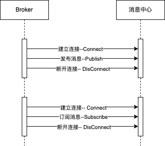

**以http实现为例**。http是go-micro默认组件实现，具体的结构体为broker.HttpBroker

```go
type httpBroker struct {
   id      string
   address string
   opts    Options

   mux *http.ServeMux

   c *http.Client
   r registry.Registry

   sync.RWMutex
   subscribers map[string][]*httpSubscriber
   running     bool
   exit        chan chan error

   // offline message inbox
   mtx   sync.RWMutex
   inbox map[string][][]byte
}
```

httpBroker包含以下几种信息

- 发布消息

httpBroker通过Publish方法发布消息

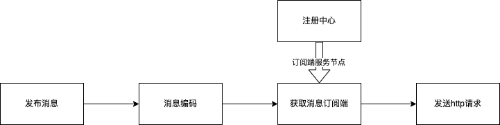

**消息编码**：httpBroker默认使用json进行消息编码。编码完的消息缓存到inbox字段中

**获取订阅端**：每个订阅端节点，都会以微服务的形式将订阅信息注册到服务注册中心。不同于其他自定义的微服务，订阅端微服务的名称为固定值：micro.http.broker。（当一个节点有订阅消息时，会注册两个微服务信息，一个是自身service定义的微服务，一个是固定的消息订阅微服务）。httpBroker先通过微服务名（micro.http.broker）获取所有的订阅端节点信息，然后通过topic过滤得到对应消息订阅端的节点列表。

**发送http请求**：httpBroker通过节点选取规则选择节点，从inbox中取出消息，并向这些节点发送http请求。

httpBroker有两种选取规则。通过broker.Queue()进行设置。

| 值                          | 规则说明                                     |
| --------------------------- | -------------------------------------------- |
| ff.http.broadcast（默认值） | 向获取订阅端得到的节点列表都进行发送         |
| 其他                        | 在获取订阅端得到的节点列表中随机选取一个发送 |

- 订阅消息

httpBroker通过Subscribe方法订阅消息


注册订阅微服务：httpBroker构建微服务信息，并注册到注册中心。微服务信息包含：服务名（固定值：micro.http.broker），消息topic，处理函数，当前节点信息等。

- 配置

httpBroker可配置的信息有：broker相关信息（地址，tls连接，上下文等），registry相关信息，编码器等

- 状态信息

httpBroker有两种状态，一种是连接状态，一种是断开状态。

| 状态     | 应用方法   | 数据存储                                                     |
| -------- | ---------- | ------------------------------------------------------------ |
| 连接状态 | Connect    | c *http.Client：缓存连接客户端。<br />r registry.Registry：缓存获取服务节点信息的注册中心<br />running bool：true<br />exit chan chan error：未退出，阻塞 |
| 断开状态 | DisConnect | c *http.Client：空<br />r registry.Registry：空<br />running bool：false<br />exit chan chan error：未阻塞 |

### registry.Registry

服务注册中心组件，用于与注册中心交互。服务注册中心存储所有的服务节点信息，以便于其他节点能够获取。

```go
type Registry interface {
   Init(...Option) error
   Options() Options
   Register(*Service, ...RegisterOption) error
   Deregister(*Service, ...DeregisterOption) error
   GetService(string, ...GetOption) ([]*Service, error)
   ListServices(...ListOption) ([]*Service, error)
   Watch(...WatchOption) (Watcher, error)
   String() string
}
```

组件基本逻辑

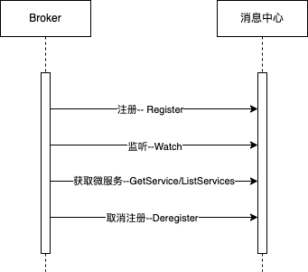

**以etcd实现为例。**etcd实现不是go-micro的默认实现，需要引入[go-micro组件库](https://github.com/go-micro/plugins)。etcd实现的结构体为etcd.etcdRegistry。

```go
type etcdRegistry struct {
   client  *clientv3.Client
   options registry.Options

   sync.RWMutex
   register map[string]uint64
   leases   map[string]clientv3.LeaseID
}
```

etcdRegistry包含以下信息

- 注册

etcdRegistry通过etcd的api进行注册、续约、删除等操作。

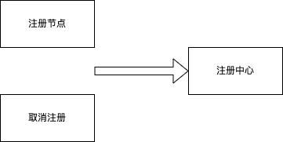

etcdRegistry包含两个注册相关数据。

**register map[string]uint64**：存储已注册节点的hash值，当该节点再次发起注册时，对比节点信息是否有更改。

**leases map[string]clientv3.LeaseID**：存储已注册节点的LeaseID，当该节点再次发起注册时（注册心跳维持场景），进行注册续约。

- 配置

配置信息包含registry连接配置（地址，ttl，tls，上下文等），etcd连接客户端。

### transport.Transport

微服务调用组件。定义服务间通信方式。

```go
type Transport interface {
   Init(...Option) error
   Options() Options
   Dial(addr string, opts ...DialOption) (Client, error)
   Listen(addr string, opts ...ListenOption) (Listener, error)
   String() string
}
```

组件基本逻辑

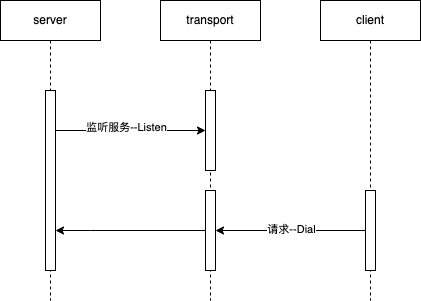

**以http实现为例。**transport.httpTransport是go-micro的默认实现。

```go
type httpTransport struct {
   opts Options
}
```

httpTransport包含以下信息

- 监听


**端口监听**：启动tcp端口监听。返回监听器httpTransportListener。

**建立连接**：使用监听器的Accept方法监听所有路由请求，组装成httpTransportSocket，发送到Server进行处理。

- 请求

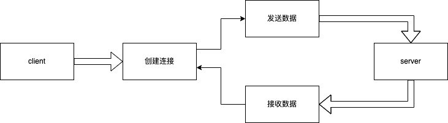

**创建连接**：创建tcp连接到服务端。返回客户端httpTransportClient。

**发送数据**：通过Send方法，将请求写入到连接中。

**接收数据**：通过Recv方法，从连接中读取响应。

- 配置

配置包含：连接地址，tls，ttl，上下文等。

## 功能组件

功能组件在核心流程中并未使用。应根据需要自行使用。

### auth.Auth

认证组件

```go
type Auth interface {
   // Init the auth
   Init(opts ...Option)
   // Options set for auth
   Options() Options
   // Generate a new account
   Generate(id string, opts ...GenerateOption) (*Account, error)
   // Inspect a token
   Inspect(token string) (*Account, error)
   // Token generated using refresh token or credentials
   Token(opts ...TokenOption) (*Token, error)
   // String returns the name of the implementation
   String() string
}
```

组件基本逻辑

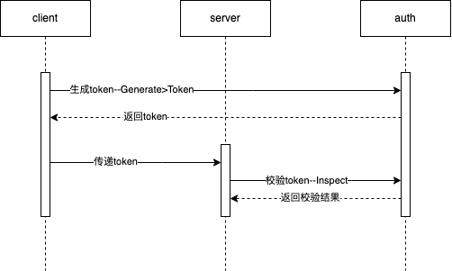

**以jwt实现为例。**go-micro默认没有实现。组件库中jwt实现的结构体为jwt.jwt

```go
type jwt struct {
   sync.Mutex
   options auth.Options
   jwt     jwtToken.Provider
}
```

jwt包含以下信息

- token生成器

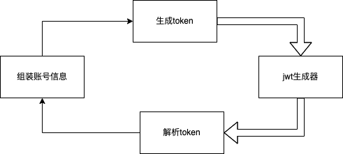

**组装账号信息**：通过Generate方法生成账号信息，账号信息包含用户id，secret（由jwt生成器生成，用于传递到token解析），自定义信息等。

**生成token**：通过账号的secret解析出完整的账号信息（secret时效为15min，超时无法头盖骨secret解析账号信息）。然后再通过jwt生成器，对账号信息进行加密，生成具有指定时效的accesstoken和refreshtoken（refreshtoken的时效比accesstoken的长1h）。

**解析token**：从token值（accesstoken或refreshtoken）中解析出账号信息，超时的无法解析。

- 配置

包含的配置信息有：jwt生成器配置（jwt公钥，私钥，token有效时间等），账号信息配置（自定义信息等）

### cache.Cache

缓存组件 

```go
type Cache interface {
   // Get gets a cached value by key.
   Get(ctx context.Context, key string) (interface{}, time.Time, error)
   // Put stores a key-value pair into cache.
   Put(ctx context.Context, key string, val interface{}, d time.Duration) error
   // Delete removes a key from cache.
   Delete(ctx context.Context, key string) error
   // String returns the name of the implementation.
   String() string
}
```

组件基本逻辑

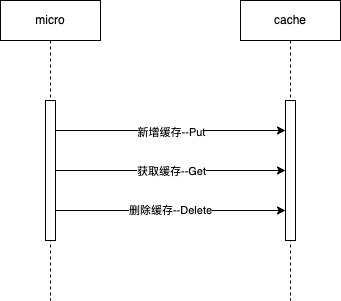

以redis实现为例。go-micro的缓存是key-value格式，默认memory实现，redis的实现结构体为redis.redisCache

```go
type redisCache struct {
   opts   cache.Options
   client redis.UniversalClient
}
```

redisCache包含以下信息

- redis客户端

用于和redis进行交互。

- 配置

配置信息包含：缓存有效时间，缓存服务器地址，上下文等。

### cmd.Cmd

命令行组件。定义参数等

```go
type Cmd interface {
   // The cli app within this cmd
   App() *cli.App
   // Adds options, parses flags and initialise
   // exits on error
   Init(opts ...Option) error
   // Options set within this command
   Options() Options
}
```

go-micro的默认实现为cmd.cmd

```go
type cmd struct {
   opts Options
   app  *cli.App
}
```

cmd通过[urfave/cli](https://github.com/urfave/cli)实现参数的设置与读取


**设置参数**：通过设置cli.App的Flags进行参数设置。Flags包含参数类型，命令行参数名称，环境变量（多个值），参数说明，默认值等。

**解析参数**：cli.App会将参数写入到cli.Context中，然后通过设置cli.App的Action进行参数的解析。

### config.Config

配置组件，与配置中心交互

```go
type Config interface {
   // provide the reader.Values interface
   reader.Values
   // Init the config
   Init(opts ...Option) error
   // Options in the config
   Options() Options
   // Stop the config loader/watcher
   Close() error
   // Load config sources
   Load(source ...source.Source) error
   // Force a source changeset sync
   Sync() error
   // Watch a value for changes
   Watch(path ...string) (Watcher, error)
}
```

go-micro的默认实现为config.config

```go
type config struct {
   exit chan bool
   opts Options

   sync.RWMutex
   // the current snapshot
   snap *loader.Snapshot
   // the current values
   vals reader.Values
}
```

config包含以下信息

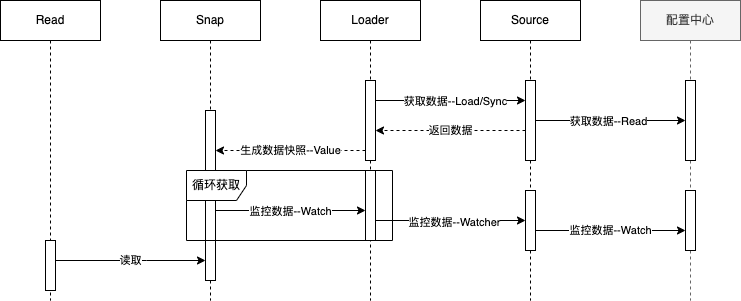

- 获取数据

config通过Load方法或Sync方法，从数据源获取数据。获取到数据后，生成数据快照。

- 监听数据

连接到数据源后，config每隔1s从数据源同步数据，监控配置中心数据是否发生变化，当数据变动时，重新生成新的快照数据。

- 生成快照

数据快照由两个部分构成

**配置数据**：从配置中心读取到的数据

**版本**：生成快照的时间戳，保证缓存的快照都是最新的。

- 读取数据

go-micro的配置数据会解析为json格式

**获取**：通过path获取对于值

**删除/更新**：只能操作本地的内存数据，配置中心的数据不会发生变化

### runtime.Runtime

服务管理组件。可用于管理其他微服务

```go
type Runtime interface {
   // Init initializes runtime
   Init(...Option) error
   // Create registers a service
   Create(*Service, ...CreateOption) error
   // Read returns the service
   Read(...ReadOption) ([]*Service, error)
   // Update the service in place
   Update(*Service, ...UpdateOption) error
   // Remove a service
   Delete(*Service, ...DeleteOption) error
   // Logs returns the logs for a service
   Logs(*Service, ...LogsOption) (LogStream, error)
   // Start starts the runtime
   Start() error
   // Stop shuts down the runtime
   Stop() error
   // String describes runtime
   String() string
}
```

**以kubernetes实现为例。**go-micro的默认实现为runtime.runtime，只适用于所有服务在同一个操作系统中的场景。组件的kubernetes实现为kubernetes.kubernetes，适用于kubernetes环境。

*为了区分，以下通过kubernetes表示runtime的组件，k8s表示kubernetes环境*

```go
type kubernetes struct {
   sync.RWMutex
   // options configure runtime
   options *runtime.Options
   // indicates if we're running
   running bool
   // used to stop the runtime
   closed chan bool
   // client is kubernetes client
   client client.Client
   // namespaces which exist
   namespaces []client.Namespace
}
```

go-micro中的微服务节点对应kubernetes中的pod，可通过Deployment和Service进行控制。故对runtime对微服务的管理，就是对k8s资源的管理。

kubernetes包含以下信息

- kubernetes客户端

kubernetes客户端用于请求kubernetes的kube-apiserver。管理k8s资源。


**监听微服务事件**：runtime组件启动后，会监听从微服务传递过来的事件，事件包含：服务创建，服务更新，服务删除。

**传递到kubernetes**：调用kube-apiserver，操作Deployment和Service资源。

- 配置信息

配置信息包含有：定时任务（组件启动后执行，可创建微服务事件），kubernetes信息（镜像名称，资源类型等）

- 状态信息

微服务运行的命名空间

组件的运行状态（启动，关闭）

### profile.Profile

pprof组件，采集性能数据

```go
type Profile interface {
   // Start the profiler
   Start() error
   // Stop the profiler
   Stop() error
   // Name of the profiler
   String() string
}
```

**以profiler实现为例。**实现结构体为pprof.profiler

```go
type profiler struct {
	opts profile.Options

	sync.Mutex
	running bool

	// where the cpu profile is written
	cpuFile *os.File
	// where the mem profile is written
	memFile *os.File
}
```

profiler包含以下信息

- 性能分析

profiler使用go自带的pprof进行性能分析。

cpuFile *os.File：cpu性能分析结果文件，通过pprof.StartCPUProfile方法记录

memFile *os.File：内存性能分析结果文件，通过pprof.WriteHeapProfile方法记录

- 配置信息

配置信息包含：分析名称（生成临时文件的名称）

- 状态信息

状态信息包含：组件的运行状态。

### store.Store

数据存储组件。与数据中心交互，go-micro数据存储组件支持key-value格式数据。

```go
type Store interface {
   // Init initialises the store. It must perform any required setup on the backing storage implementation and check that it is ready for use, returning any errors.
   Init(...Option) error
   // Options allows you to view the current options.
   Options() Options
   // Read takes a single key name and optional ReadOptions. It returns matching []*Record or an error.
   Read(key string, opts ...ReadOption) ([]*Record, error)
   // Write() writes a record to the store, and returns an error if the record was not written.
   Write(r *Record, opts ...WriteOption) error
   // Delete removes the record with the corresponding key from the store.
   Delete(key string, opts ...DeleteOption) error
   // List returns any keys that match, or an empty list with no error if none matched.
   List(opts ...ListOption) ([]string, error)
   // Close the store
   Close() error
   // String returns the name of the implementation.
   String() string
}
```

**以redis实现为例**。redis实现的结构体为redis.rkv

```go
type rkv struct {
	ctx     context.Context
	options store.Options
	Client  redis.UniversalClient
}
```

rkv包含以下信息

- 数据中心客户端

通过redis客户端与redis进行交互，实现数据的增删改查。

- 配置

组件配置包含：数据中心节点配置，数据库，数据表。

### logger.Logger

日志记录组件

```go
type Logger interface {
   // Init initialises options
   Init(options ...Option) error
   // The Logger options
   Options() Options
   // Fields set fields to always be logged
   Fields(fields map[string]interface{}) Logger
   // Log writes a log entry
   Log(level Level, v ...interface{})
   // Logf writes a formatted log entry
   Logf(level Level, format string, v ...interface{})
   // String returns the name of logger
   String() string
}
```

go-micro默认日志记录实现为logger.defaultLogger

```go
type defaultLogger struct {
   sync.RWMutex
   opts Options
}
```

defaultLogger包含以下信息

- 日志记录

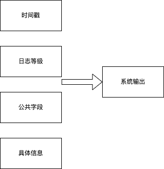

defaultLogger将日志记录的当前时间戳，日志等级，公共字段（通过Filed方法设置），具体信息。通过fmt.Printf函数输出到系统的STDOUT中

- 配置

组件配置包含：日志记录等级，公共字段，输出，上下文等。

# 启动微服务

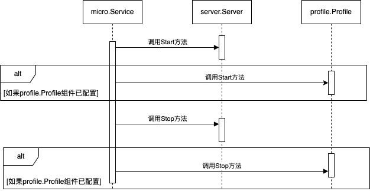

1. 使用micro.Service的Run方法启动微服务时，调用server.Server的Start方法来启动Server组件。如果profile.Profile已经配置到了micro.Service的Options中，调用profile.Profile的Start方法来启动Profile组件。
2. 服务启动完成后，开启服务关闭监听，服务关闭有以下两种方式。
   - 信号关闭：系统接收到SIGTERM、SIGINT、SIGQUIT或SIGKILL信号时，关闭服务。可通过配置项（Signal）取消该关闭方式。
   - 上下文关闭：触发了micro.Service中的定义的上下文的取消方法时，关闭服务。
3. 使用server.Server的Stop方法，停止Server组件
4. 使用profile.Profile的Stop方法，停止Profile组件

## 启动Server组件

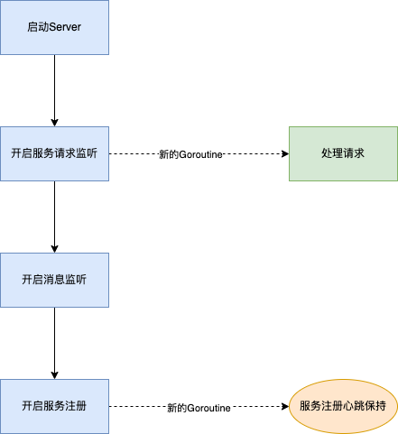

**启动Server**

使用server.Server的Start方法启动Server

**开启服务监听**

使用transport.Transport的Listen方法开启服务监听。

**开启消息监听**

使用broker.Broker的Connect方法开启消息监听。

**开启服务注册**

先使用RegisterCheck定义的方法进行服务注册检查。检查通过后，再使用Register方法进行服务注册。

**处理请求线程**

处理请求线程，是用来接收到服务请求。并进行后续处理。

**服务注册心跳保持线程**

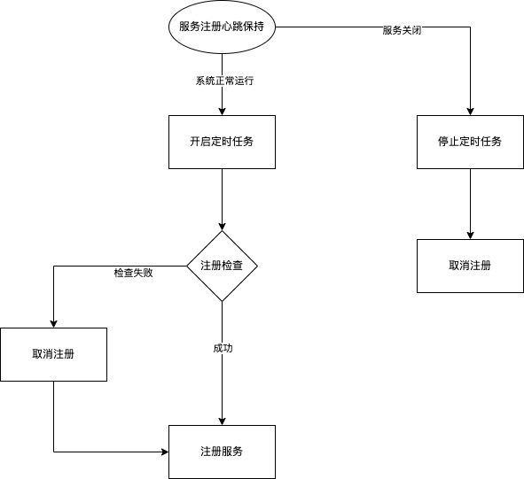

1. 系统正常运行时，开启定时任务。每隔30s使用RegisterCheck定义的方法进行注册检查，检查通过时，直接使用Register注册；检查失败时，先使用Deregister方法取消注册，再使用Deregister方法重新注册。
2. 使用通道监听服务状态，当收到服务关闭时，停止定时任务，使用Deregister方法取消注册。

**服务注册（Register方法）**

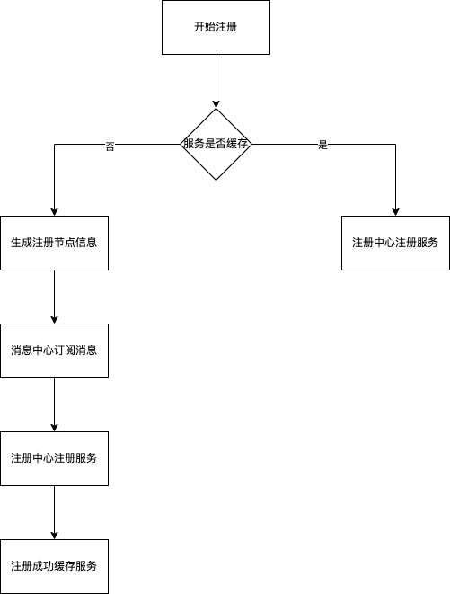

1. 开始注册后，先从缓存中获取服务信息，由于需要进行服务注册心跳保持机制，每次注册的服务信息不会发生变化，故可以将需要注册的服务信息进行缓存。
2. 服务已经进行了缓存，直接获取缓存中的服务信息，使用registry.Registry的Register方法在注册中心注册服务。
3. 服务未进行缓存，先生成节点信息。节点信息包含有：服务名称，服务版本，服务监听的端点（服务请求处理端点和消息通知处理端点），节点信息。
4. 使用broker.Broker的Subscribe方法在消息中心订阅消息，消息订阅端是用来绑定订阅的消息和对该消息的处理逻辑。
5. 使用regisry.Registry的Register方法在注册中心注册服务。注册失败时会进行重试，共3次。
6. 注册成功后，将服务信息进行缓存。

**取消注册（Deregister方法）**


1. 取消注册时，先生成节点的简要信息。
2. 根据节点简要信息，使用registry.Registry的Deregister方法取消该节点的注册。
3. 调用每个订阅端端Unsubscribe方法，在消息中心取消订阅
4. 清除服务信息的缓存

## 启动Profile组件

使用go自带的pprof进行启动性能分析

## 停止Server组件

使用通道通知服务注册心跳保持线程服务已关闭，修改服务的启动状态。

## 停止Profile组件

停止pprof性能分析

